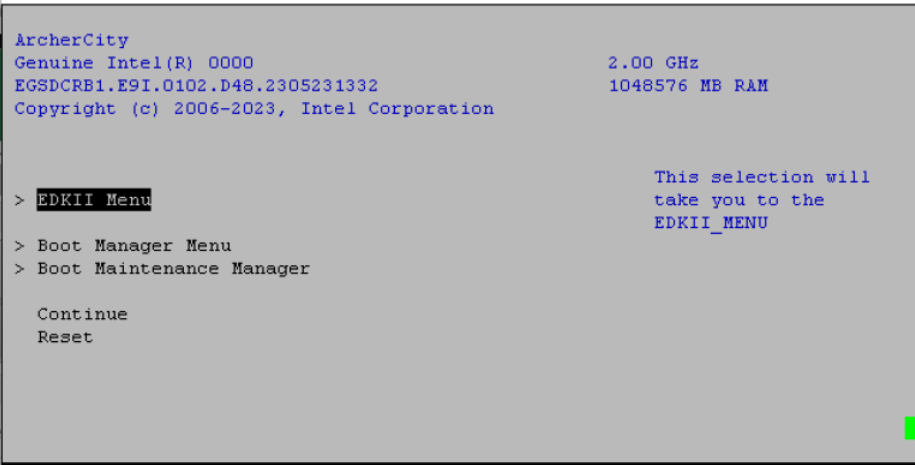
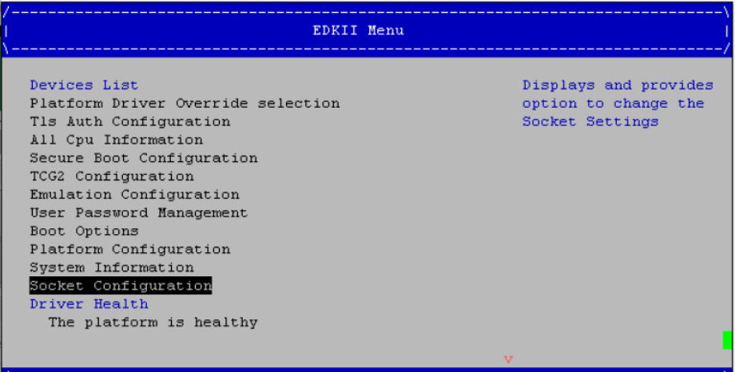
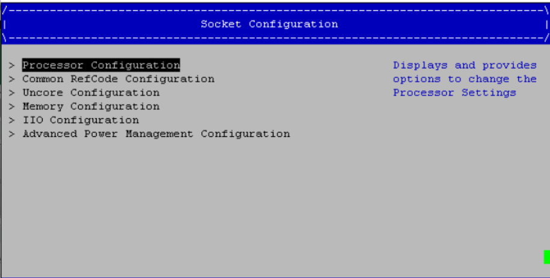
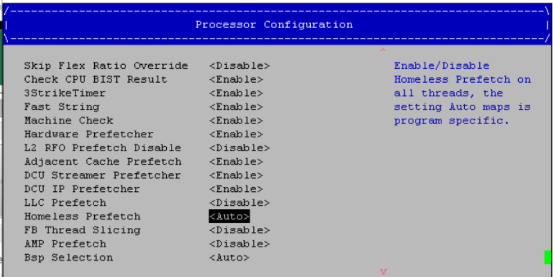
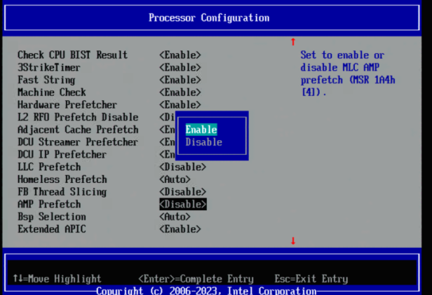

# LLM GPT-j (Large Language Model) based on Intel Extension For PyTorch
We provide the `Dockerfile.llm` used for building docker image with PyTorch, IPEX and Patched Transformers installed. The GPT-j model is using [EleutherAI/gpt-j-6B](https://huggingface.co/EleutherAI/gpt-j-6B).

## File structure
- `Dockerfile.llm`: The dockerfile used for dependencies installation.
- `run_gptj.json`: The inference benchmark script enabled ipex optimization path is used for measuring the performane of GPT-j.
- `prompt.json`: prompt.json for run_gptj.py
- `transformers.patch`: The patch file for transformers v4.26.1. This patch file also enabled our IPEX optimization for transformers and GPT-j.

## SW ENV
- **PyTorch**: [20230518 nightly](https://github.com/pytorch/pytorch/commit/329bb2a33e40f4bc76b2e061b180d3234984c91b)
- **IPEX-CPU**: master branch, commit [de88d93](https://github.com/intel/intel-extension-for-pytorch/commit/de88d938c940da06274ce64079e93d6aefcaa49d)

## HW ENV
### Enable Adaptive Multipath Prefetcher (AMP) And Homeless Prefetcher
#### Option 1: Use `msr-tools`
1. Install msr-tools (e.g. `yum install msr-tools`)
2. Check your default setting to reset once done: `rdmsr 0x1a4` `rdmsr 0x6d`
3. Enable AMP: `wrmsr -a 0x1a4 0x00`
4. Enable Homeless Prefetcher: `wrmsr -a 0x6d 040040008000`
5. (optional) After running performace test, restore default value from step 2

#### Option 2: Use BIOS






## Build Docker image
- Option 1 (default): you could use `docker build` to build the docker image in your environment.
```
docker build ./ -f Dockerfile.llm -t llm_centos8:latest
```

- Option 2: If you need to use proxy, please use the following command
```
docker build ./ --build-arg http_proxy=${http_proxy} --build-arg https_proxy=${http_proxy} -f Dockerfile.llm -t llm_centos8:latest
```

## Run GPT-j script
- **Step 1 Docker run**: We need to use `docker run` which helps us run our scirpt in docker image built previously.
```
# Docker run into docker image
docker run --privileged -v `pwd`:/root/workspace -it llm_centos8:latest
```

- **Step 2 Environment Config**: Tcmalloc is a recommended malloc implementation that emphasizes fragmentation avoidance and scalable concurrency support.
```
# Activate conda env
source activate llm

# Env config
export KMP_BLOCKTIME=INF
export KMP_TPAUSE=0
export KMP_SETTINGS=1
export KMP_AFFINITY=granularity=fine,compact,1,0
export KMP_FORJOIN_BARRIER_PATTERN=dist,dist
export KMP_PLAIN_BARRIER_PATTERN=dist,dist
export KMP_REDUCTION_BARRIER_PATTERN=dist,dist
# IOMP & TcMalloc
export LD_PRELOAD=/root/anaconda3/envs/llm/lib/libiomp5.so:/root/anaconda3/envs/llm/lib/libtcmalloc.so:${LD_PRELOAD}
```

- **Step 3 Run GPT-j script**: At this step, we could activate our conda env and run GPT-j script with the following configuration: `max-new-tokens=32 num_beams=4`
```
export CORES=$(lscpu | grep "Core(s) per socket" | awk '{print $NF}')

# Run GPT-j workload
bash run.sh

# Or
OMP_NUM_THREADS=${CORES} numactl -N 0 -m 0 python run_gptj.py --ipex --jit --dtype bfloat16 --max-new-tokens 32

# Run GPT-j workload with TPP
OMP_NUM_THREADS=${CORES} numactl -N 0 -m 0 python run_gptj.py --use-tpp --jit --dtype bfloat16 --max-new-tokens 32

# Note: the numactl parameters above should be used for HBM-cache mode.
# For flat configuration in quad mode use '-N 0 -m 2' to use the HBM memory.
# IPEX 
OMP_NUM_THREADS=${CORES} numactl -N 0 -m 2 python run_gptj.py --ipex --jit --dtype bfloat16 --max-new-tokens 32
# TPP
OMP_NUM_THREADS=${CORES} numactl -N 0 -m 2 python run_gptj.py --use-tpp --jit --dtype bfloat16 --max-new-tokens 32
```
